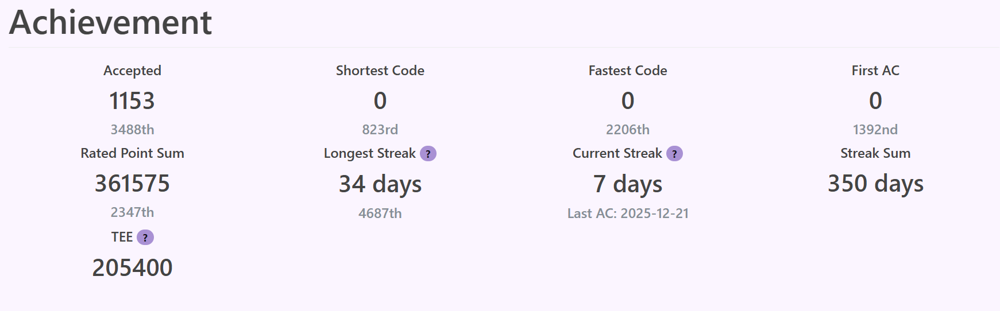
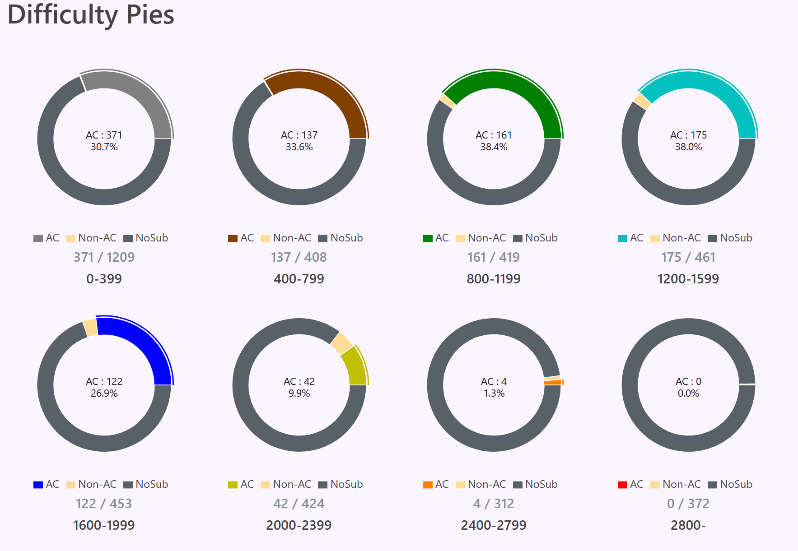

**青色**コーダーのsuyasuyaTYです！！！  
AtCoderを再開してから約2年、ついにABC437で青色になることができたので、これまでの競プロの精進方法について書いていきます。

## 典型アルゴリズム

典型アルゴリズムについては、水色になるまでにE869120さんの記事で紹介されているアルゴリズムを一通り学習しました。  
学習の手順としては以下の通りです。

1. 記事を読んで概要を理解する
2. 分野別過去問を、**アルゴリズムの解説記事**を見ながら解く
   1. 10分悩んでわからなかったら、解説と強い人のコードを見る（僕はkyopro_friendsさんやSSRSさんのコードを参考にしていました）
   2. 次の日に、解説を見ずにもう一度解く
3. 最後にまたアルゴリズムの解説記事を読み、今度は「なぜ正しく動くのか」を理解する

https://qiita.com/e869120/items/eb50fdaece12be418faa

https://qiita.com/e869120/items/acba3dd8649d913102b5

## ACL（AtCoder Library）に慣れる

ACLはAtCoderが公式で提供しているライブラリで、競技プログラミングでよく使うデータ構造やアルゴリズムが実装されています。ACLを使いこなせるようになると、コードを書くスピードが格段に上がり、実装ミスも減るので、水色になるには必須だと思います。

https://github.com/atcoder/ac-library

遅延セグメント木はいまだにチートシートを見ないとバグを発生させてしまうので、僕ももっと慣れないといけないなと思っています。

https://betrue12.hateblo.jp/entry/2020/09/23/005940

## 過去問を使った実践練習

ここまでの武器が揃ったら、あとは実践練習あるのみです。典型アルゴリズムを一通り学習したあとは、過去問を使って実践練習を行いました。

そもそもABCコンテストで出題される問題は、典型アルゴリズムを使いこなすための練習問題として最適化されています。発想問題に関しても、発想の「典型的な方法」を問う問題が多いです。なので、問題と解法のストックを蓄え、必要なときに素早く引き出す力が、青色までは特に求められると感じました。

また、考察が必要な問題を解くには、そこに時間を割けるようにそれまでの問題を素早く処理する力が必要です。そういう意味では、青色までに求められるのは「速解き能力」と言っても過言ではないでしょう。

そのための精進方法を書こうとしていたら、AtCoder公式ブログで同じような内容の記事が公開されていました。こちらを読んでいただいても良いと思います。

https://info.atcoder.jp/entry/2025/12/03/170000

ここからはその力をつけるために僕が行った練習方法について書いていきます。

### ABC212~317（1周目）：典型問題ストックを増やす

まずは、ABC212からABC317までのE, Fを1周解きました。この範囲を選んだ理由は、けんちょんさんのツイートで「完全マスターすれば黄色になれる」という趣旨の内容を見たからです。

<blockquote class="twitter-tweet tw-align-center">
   
これもすごく大事な話っぽいです！！  ABC 212〜317 の A〜F を、思考を自動化できるレベルまで練習を繰り返すことが良いそうです！！！  たとえば、C 問題を 2 分で解けとまでは言わないけど、10 分かかってるようだと何かしら身に付いていない可能性があって、そのままではいけないと言っていました <a href="https://t.co/ErqQcVi4iT">https://t.co/ErqQcVi4iT</a>
&mdash; けんちょん (@drken1215) <a href="https://twitter.com/drken1215/status/1919710467066626284?ref_src=twsrc%5Etfw">May 6, 2025</a>
</blockquote>

僕は最初、1問に対して30〜40分ほどかけてじっくり考えていましたが、典型知識が身についていない段階だと解けない問題も多く、無駄が多かったと思います。初見の問題に対する考察力を鍛える用の問題は後に残しておき、この段階では典型知識を増やすことに専念するのが良いと思います。

この段階では、次のような流れで問題を解き進めるといいと思います。

1. 10分考えてわからなかったら、解説と他の人のコードを見る
2. 典型知識になりそうなものをノートにまとめ、必要であればライブラリを作成する
3. 次の日に、解説を見ずに証明（考察）を構築できるか確認する（コードを書く必要はない）

### ABC212~317（2周目以降）：速解き能力を鍛える

1周目で典型知識を一通りインプットしたら、次は速解き能力を鍛えるフェーズに入ります。この段階では、同じ範囲の問題を何度も解き直します。

この段階では、久しぶりに問題を見ても一瞬で解法が思い浮かぶレベルを目指します。E問題は見た瞬間に解法が浮かび、F問題も10分以内に解法を思いつき、実装しながら証明まで組み立てられるくらいを目標にすると良いと思います。

ここでは、解けなくてもすぐに解説を見るのではなく、問題文からいろいろ手を動かしながら考察してみることが大事です。ABCレベルの問題では「どこかで見たことはあるが、完全な既出ではない」というケースがよくあります。そういう問題に対して、うろ覚えの解説や方針を思い出しながら解法にたどり着く練習をすることが重要です。

少なくとも1回は、解説を見ずにコードをバグらせずに書けるようになるまで繰り返し解き直しましょう。僕はD、E問題は前回解けていれば、空き時間などにコードを書かず、考察と証明だけを頭の中で済ませることもあります。一方でF問題は、考察が思いついてもコーナーケースで落ちることが多かったので、毎回コードまで書くようにしています。

2回目になっても解けない問題は、相当苦手なタイプだと思います。公式解説やユーザー解説をじっくり読み込み、自分の言葉で書き直して理解を深めましょう。

### ABC318以降：実践練習

ABC318以降の問題は、これまでの学習で身に付けた典型知識が初見問題にも通用するかを試す場として使います。
本番のABCを意識して、E問題は30分、F問題は60分くらいを目安に時間をかけて取り組みました。

復習については、ABC212〜317のときと同様の手順で進めています。

### 入青時のデータ

やりすぎといっても過言ではない。

## 最後に

ここまで読んでくださり、ありがとうございました。
青色になるために大事なことは、どんな精進法よりも、継続するためのモチベーションを保ち続けることだと思います。

僕の場合は27卒ということもあり、就活生向けのオンサイトイベントが複数開催されていました。そこで競プロerの方々と交流できたことが、モチベーション維持につながった面が大きいです。
オンサイトイベントを企画・運営してくださった方々には、本当に感謝しています。
